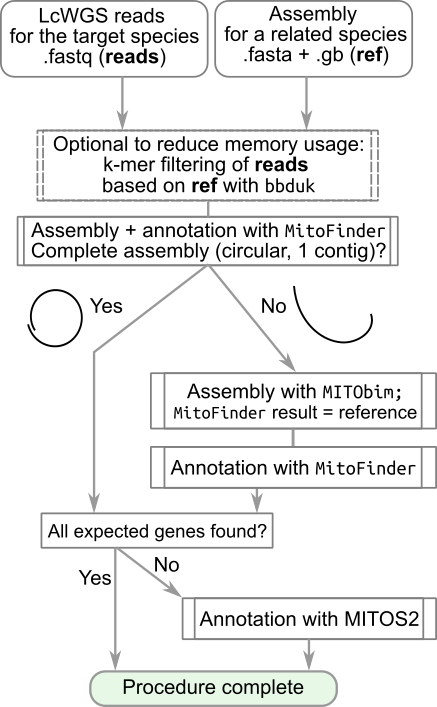

# mt_genome_benchmark
This repository contains reproducible code for a benchmark of most existing tools for animal mitochondrial genome assembly and annotation on the example of Baikal amphipods.

If you:
  * would like to skip the detail and just go to the recommended procedure for mitochondrial genome assembly (command-line interface) from short whole-genome reads, go to the next section;
  * need to reconstruct mitochondrial genome from RNA-seq, we recommend starting with MitoZ (https://github.com/linzhi2013/MitoZ);
  * wish to reproduce assembler benchmark or perform a similar analysis using own data, please check out [Procedure 1. Multi-assembler algorithm](https://github.com/drozdovapb/mt_genome_benchmark/tree/main/1_assembly/README.md);

## Recommended procedure

We found that the following procedure has maximal efficiency:




> [!IMPORTANT]
> **Execution Guide:**

> Before running the workflow on your own data, it is recommended to copy all commands into a local text editor. Replace the placeholders with your actual sequencing data paths and output filenames. Since the code block includes line breaks, editing it in a text file first is much more convenient than modifying it directly in the terminal.

> Please note that some of the programs may be not needed depending on the data, so it might make sense to install the optional software along the way.

### Dependencies

This pipeline has been tested in several Linux distributions. It uses the following programs:

 - (_optional_) `NCBI sratools` (https://github.com/ncbi/sra-tools) for downloading raw reads from NCBI;
 - `BBTools` (https://bbmap.org/) for read manipulation;
 - (_optional_) FastQC (https://www.bioinformatics.babraham.ac.uk/projects/fastqc/) for checking read quality;
 - MitoFinder, which can be installed in two ways:
   - for direct compilation (https://github.com/RemiAllio/MitoFinder); we highly recommend creating a reserved conda environment using python 2.7;
   - or as a Singularity containter (https://github.com/RemiAllio/MitoFinder_container/); requires Singularity;
   - or a Docker container (https://hub.docker.com/r/chrishah/mitobim); requires Docker.
 - (_optional depending on MitoFinder results_) MITObim (https://github.com/chrishah/MITObim);
   - Please also note that this installation requires MIRA == 4.0.2 (https://sourceforge.net/projects/mira-assembler/files/MIRA/stable/) for MITObim 1.8, and newer versions of MIRA would not work;
   - MITObim is also available in Galaxy (https://usegalaxy.eu/ and https://usegalaxy.org.au/)
 - (_optinal_) Seqkit for read file manipulation (https://bioinf.shenwei.me/seqkit/).
 - (_optional depending on MitoFinder annotation results_) MITOS2 for annotation (https://gitlab.com/Bernt/MITOS/-/tree/mitos2); also available from Galaxy (https://usegalaxy.org; https://usegalaxy.eu; https://usegalaxy.org.au; https://usegalaxy.fr)

Particular versions used in this work are available in the [full procedure](https://github.com/drozdovapb/mt_genome_benchmark/tree/main/1_assembly/README.md), but in general this procedure should work with any recent version.


### Data

  - Short genome reads for the studied organism. 
    - In this demonstration it will be *Ommatogammarus flavus* `DRR911170`, which can be downloaded like this: `fasterq-dump --progress DRR911170` or `fastq-dump -A DRR911170 -v -v --split-3`.
  - Assembly of a related mitochondrial genome in .fasta and genbank formats. The reference does not have to be very close. However, the closer the genome, the faster the analysis will be and the better the chance of assembling a complete genome is. 
    - In this demonstration we use *Eulimnogammarus cyaneus*. The studied species are separated by a phylogenetic distance close to 0.5 substitutions/site and have split up ~15 million years ago based on the analysis of 15 mitochondrial genes. Reference *E. cyaneus* genome (Romanova et al., 2016) is available from NCBI Genbank in [fasta](https://www.ncbi.nlm.nih.gov/nuccore/KX341964.1?report=fasta) and [genbank](https://www.ncbi.nlm.nih.gov/nuccore/KX341964.1?report=genbank) formats. We will save these files as `KX341964_Ecy_mt_genome.fa` and `KX341964_Ecy_mt_genome.gb`, respectively.

### Procedure

#### 1. Read preprocessing

  - Download reads using SRA/DRA/ERA accession number if necessary (see above) or prepare your own read files in fastq or fastq.gz fromat.
  - Perform adapter and quality trimming. The necessity of this step depends on the quality of the reads, which can be checked with FastQC like `fastqc *fastq` or in a graphical user interface. However, always performing it is a safe and effort-saving strategy. The exact adapter sequences depend on the particular reagents used for preparing the sequencing library, but using the code below will deal with most popular choices.

```
#download adapter sequences
curl -O -# https://raw.githubusercontent.com/BioInfoTools/BBMap/refs/heads/master/resources/adapters.fa
#trim adapters and filter reads by quality:
bbduk.sh -Xmx1G in=DRR911170_1.fastq in2=DRR911170_2.fastq out=Ofl_filt_1.fq.gz out2=Ofl_filt_2.fq.gz \
 ktrim=r k=23 mink=11 hdist=1 ref=adapters.fa
```
#### 2. *De novo* assembly with MitoFinder

  - Filter reads: optional but greatly reduces computational load, so highly recommended if performing the analysis using a personal computer. If RAM usage is not a concern, skip this step and change -1 and -2 arguments in the mitofinder run to the filtered reads above.

```
bbduk.sh in=Ofl_filt_1.fq.gz in2=Ofl_filt_2.fq.gz \
 ref=KX341964_Ecy_mt_genome.fa \
 outm=Ofl_filt_Ecym_1.fq.gz outm2=Ofl_filt_Ecym_2.fq.gz k=17 \
 rcomp=t qhdist=0 -Xmx2g
```
  - Run MitoFinder. If it was installed via a conda environment, first activate it.
 
```
#If you are not using Conda, skip this line.
conda activate mitofinder
#Run MitoFinder
mitofinder -j Ofl_2Ecy_mf -1 Ofl_filt_Ecym_1.fq.gz -2 Ofl_filt_Ecym_2.fq.gz -o 5 -r KX341964_Ecy_mt_genome.gb
```
  - Tip: `-o 5` corresponds to the genetic code (in this case, 5 for invertebrate mitochondrial) and depends on the studied taxon. 

   - Check the result by inspecting the log file. If the expected number of genes (15 genes for Metazoa) and a circular mitochondrial genome (in case the genome of the studied organism is expected to be circular) were found, this is the finished mitochondrial genome assembly. The annotation results are found in the folder named as `<samplename>_MitoFinder_megahit_mitfi_Final_Results/`.
    - In this case, we will find that MitoFinder found four mitochondrial contigs with 12, 3, 2, and 1 genes (some genes were found twice) and did not find any evidence of circularization.

#### 3. Run additional assembly step with MITObim

  - Preprocess reads: for MITObim, reads need to be interleaved, and this file needs to have the `fastq.gz` extension. Please note that at this stage we need the adapter and quality-trimmed reads **not** filtered to match the reference.

```
bbduk.sh -Xmx1G in=Ofl_filt_1.fq.gz in2=Ofl_filt_2.fq.gz out=Ofl_filt_interleaved.fastq.gz
```
  - Run MITObim using the largest contig from the MitoFinder assembly (in this case, we will save it to a file `Ofl_2Ecy_mf_largest_mtDNA_contig.fasta`):

```
MITObim.pl -start 1 -end 30 -sample Ofl -ref Ofl_mf -readpool Ofl_filt_interleaved.fastq.gz --kbait 31 --quick Ofl_2Ecy_mf_largest_mtDNA_contig.fasta
```
   - Tip: `MITObim.pl` needs to be in your `$PATH` for this command, or you can provide full path to the script.
   - Tip: `-sample` and `-ref` are string variables that do not have to match any files, but they need to be provided. They only define the name of the resulting file.
   - Tip: MITObim relies on MIRA, which must also be added to your `$PATH`.
   - Tip: if you are low in disk space, adding the option `--clean` might help, as it removes older iterations.
   - Tip: if you are running a non-English locale and receive an error connected to that, execute the following command: `export LC_ALL=C` before the MITObim run.
   - Tip: if you receive an error connected to repeated read names, rename the reads like this `seqkit rename Ofl_filt_interleaved.fastq.gz -o Ofl_filt_interleaved_renamed.fastq.gz` and feed MITObim.pl the resulting file as `-readpool`.

  - Annotate the MITObim assembly result with MitoFinder. The final assembly can be found in the `iteration*` folder with the largest number and has the name ending with `noIUPAC.fasta`.
    - Tip: if using MitoFinder in a conda environment, do not forget to activate it again if it was deactivated.

```
mitofinder -a iteration15/Oal_D2-Oal_D2_mf-it11_noIUPAC.fasta -r KX341964_Ecy_mt_genome.gb -o 5 -j Ofl_mf_mb
```

  - Inspect the log file and the `<samplename>_MitoFinder_megahit_mitfi_Final_Results/` folder to assess circularization and assembly quality, as well the found genes. In our *O. flavus* example, at this stage we obtained a complete circular genome with all genes annotated.
    - It is highly recommended to do some sanity checks at this step, such as:
      - Check if the well-studied genes (COX1 for example) belong to the correct taxon. This can be done with NCBI BLAST (https://blast.ncbi.nlm.nih.gov/).
        - Here, it is also worth checking that the obtained assembly is not overly similar to the reference, as this can happen if target species is contaminated with the reference one.
      - Count how many of expected genes (13 protein-coding, 2 rRNA genes, and in most cases 22 tRNA genes) are found. If something looks suspicious, for example one of protein-coding or rRNA genes is missing, it might be worth comparing annotation by MitoFinder with the one produced by MITOS2 to see if the problem is in assembly or annotation. MITOS2 can be run like this: `runmitos.py -c 5 -o . -r refseq89f/ Oal_D2-Oal_D2_mf-it11_noIUPAC.fasta` where `-c` is the genetic code, `-o` is the output directory, `-r` is the path to reference data that needs to be downloaded beforehand (https://zenodo.org/records/4284483), and the fasta file is the assembly. MITOS2 is also available from Galaxy (see above).
